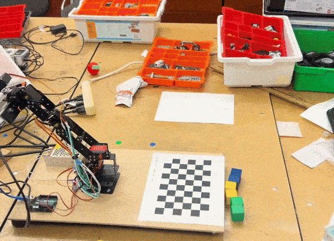
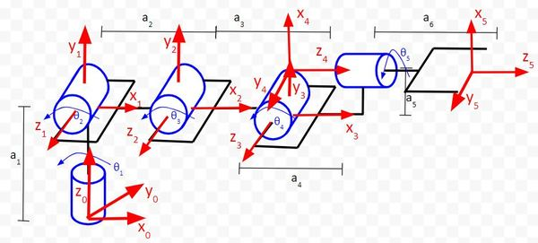

# Visarm: Vision based Pick-and-Place Robotic Arm

  

## Abstract
This project was aimed to create a 4DOF vision based pick-and-place system to color sort objects, enabling autonomous object localization, grasping, and placement. The process starts with correcting lens distortion to obtain a geometrically accurate view of the scene. A checkerboard workspace is then detected and used as a reference plane for mapping imagespace object locations into robot coordinates. Once objects within the workspace are detected, their positions are transformed into the robot frame solved using inverse kinematics. Inverse kinematics generates multiple solutions, which are evaluated through forward kinematics to identify a reachable solution. The robot executes the selected trajectory to grasp the object, followed by a verification step that confirms whether the pickup was successful. Successful grasps are subsequently placed into predefined bin locations. The system combines calibrated geometric vision with closed-loop grasp verification to ensure robust and consistent manipulation in a structured environment.

### Project Resources: [Project Report](VISARM.pdf); [Demo Video](https://youtu.be/dQCW4TNUgEI)

### More information in [notes.md](notes.md)
<!-- ## Joint Bounds

| Motor | Joint Name        | Motion 1 (°) | Motion 2 (°) |
| ----- | ----------------- | ------------ | ------------ |
| 1     | Base (ch 0)       | +90          | -80          |
| 2     | Shoulder (ch 1)   | +30          | -80          |
| 3     | Elbow (ch 2)      | +90          | -90          |
| 4     | Wrist Roll (ch 3) | +90          | -90          |
| 5     | Wrist Yaw (ch 4)  | +90          | -90          |
| 6     | Gripper (ch 5)    | +65 (open)   | +90 (close)  |

## Inverse Kinematics:

#### When does inverse kinematics have a closed form solution

The inverse kinematics has a closed form solution in the following two conditions:

- 3 of its joints are parallel to each other
- 3 of its joints has a rotation axis that intersect at a common point.

#### Overview

Given the position to point to, find the rotation and translation points for each joint so that the end-effector moves to the point.

#### Calculation

Since the robot has 6 revolute joints, we need to find 6 angles to move the robot. This involves transformations from the end-effector to the base of the robot.

- There will be 12 equations (3 position, 9 orientations)

## Overview of the arm

    

The arm has to following D-H parameters:

| Link (i) | θi (°)  | αi-1 (°) | di (in cm)         | ai-1 (in cm) |
| -------- | ------------------ | ------------- | ----------------------------- | ----------------------- |
| 1        | θ1      | 90            | a1                 | 0                       |
| 2        | θ2      | 0             | 0                             | a2           |
| 3        | θ3      | 0             | 0                             | a3           |
| 4        | θ4 + 90 | 90            | 0                             | a5           |
| 5        | θ5      | 0             | a4 + a6 | 0                       |

Substituting values we get:

| Link (i) | θi (°)  | αi-1 (°) | di (in cm) | ai-1 (in cm) |
| -------- | ------------------ | ------------- | --------------------- | ----------------------- |
| 1        | θ1      | 90            | 2                     | 0                       |
| 2        | θ2      | 0             | 0                     | 10.3                    |
| 3        | θ3      | 0             | 0                     | 9.6                     |
| 4        | θ4 + 90 | 90            | 0                     | 2.5                     |
| 5        | θ5      | 0             | 9                     | 0                       |

## Forward kinematics:

./tutorial-chessboard-pose --square_size 0.0260 --input "/home/krupal/Documents/class files/CMPUT 312/final_project/visarm/server/output/image_%d.png" --intrinsic "/home/krupal/Documents/class files/CMPUT 312/final_project/visarm/server/output/custom_camera.xml" --output "/home/krupal/Documents/class files/CMPUT 312/final_project/visarm/server/output/pose_cPo_%d.yaml"
./tutorial-hand-eye-calibration --data-path "/home/krupal/Documents/class files/CMPUT 312/final_project/visarm/server/output" --fPe pose_rPe_%d.yaml --cPo pose_cPo_%d.yaml --output "/home/krupal/Documents/class files/CMPUT 312/final_project/visarm/server/output/visarm_final_cal_output.yaml"

## Origin Position:
This position is the inital value for all the joint of the robots to get the true values from the servos. 
| Motor | Joint Name        | Angle (°)|
| ----- | ----------------- |-|
| 1     | Base (ch 0)       | 0|
| 2     | Shoulder (ch 1)   | 0|
| 3     | Elbow (ch 2)      | 0|
| 4     | Wrist Roll (ch 3) | 0|
| 5     | Wrist Yaw (ch 4)  | 0|
| 6     | Gripper (ch 5)    | 0|

## Survey Position:
This position provides a full view of the workspace(checkerboard) and the all objects should be visible.
| Motor | Joint Name        | Angle (°) |
|-------|-------------------|-----------|
| 1     | Base (ch 0)       | -6        |
| 2     | Shoulder (ch 1)   | 29        |
| 3     | Elbow (ch 2)      | 77        |
| 4     | Wrist Roll (ch 3) | 90        |
| 5     | Wrist Yaw (ch 4)  | -10       |
| 6     | Gripper (ch 5)    | —         | -->