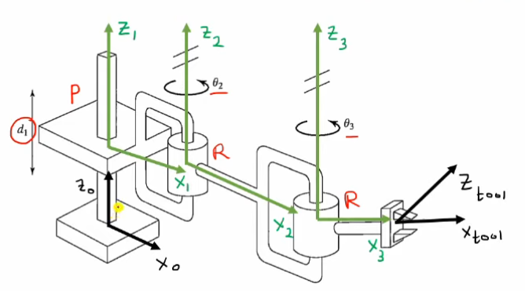

# Kinematics of 5DOF Arm

## Introduction

Our arm has 6 revolute joints, with no prismatic joints (i.e., the robot can only rotate at places). The wrist rotates as well. It has 3 joints parallel to each other.

### Types of joints

## D-H (Denavit Hartenburg Parameters)

This is a convention used to understand and define the parameters of a robot.

#### Link and Joint Paramters:

- Link Lenght (ai-1): It is the mutual perpendictular distance between 2 axis. This is the distance from zi to zi+1
- Link Twist (αi-1): Angle from axis i-1 to i. This is the angle from zi to zi+1 measured about the x-axis.
- Link Offset (di): The offset distance from one link to another. This is the distance from xi-1 to xi along the z-axis
- Joint Angle (θi): Rotation of link with respect to its neighbor (along the common axis). This is the angle from xi-1 to xi measured about the z-axis.

    

#### Example

    

<table>
    <tr>
        <th>Link (i)</th>
        <th>ai-1</th>
        <th>αi-1</th>
        <th>di</th>
        <th>θi</th>
    </tr>
    <tr>
        <td>1</td>
        <td>0</td>
        <td>0</td>
        <td>d1</td>
        <td>0</td>
    </tr>
    <tr>
        <td>2</td>
        <td>L1</td>
        <td>0</td>
        <td>0</td>
        <td>θ2</td>
    </tr>
    <tr>
        <td>3</td>
        <td>L2</td>
        <td>0</td>
        <td>0</td>
        <td>θ3</td>
    </tr>
</table>

## Overview of the arm

Note:

- θ is the angle from xn-1 to xn around zn-1.
- α is the angle from zn-1 to zn around xn.
- a is the distance between the origin of the n-1 frame and the origin of the n frame along the xn direction.
- d is the distance from xn-1 to xn along the zn-1 direction.

The arm has to following D-H parameters:

| Link (i) | θi (°)     | αi-1 (°) | di (in cm)         | ai-1 (in cm) |
| -------- | --------------------- | ------------- | ----------------------------- | ----------------------- |
| 1        | θ1         | 90            | a1                 | 0                       |
| 2        | θ2 + pi/2  | 0             | 0                             | a2           |
| 3        | -θ3        | 0             | 0                             | a3           |
| 4        | -θ4 + pi/2 | 90            | 0                             | a5           |
| 5        | θ5         | 0             | a4 + a6 | 0                       |

(For joints 2, 3, and 4 if you want to change the direction in the global x axis, negate theta.)

Substituting values we get:

| Link (i) | θi (°)     | αi-1 (°) | di (in cm) | ai-1 (in cm) |
| -------- | --------------------- | ------------- | --------------------- | ----------------------- |
| 1        | θ1         | 90            | 2                     | 0                       |
| 2        | θ2 + pi/2  | 0             | 0                     | 10.3                    |
| 3        | -θ3        | 0             | 0                     | 9.6                     |
| 4        | -θ4 + pi/2 | 90            | 0                     | 2.5                     |
| 5        | θ5         | 0             | 9                     | 0                       |

## Forward kinematics:

This is easy to calculate. Give the angles, the translations and the link lenghts and it will output the position of the end-effector. It works by applying transformation matrices at each joint and hence we get the end-effector position in the final.

## Inverse Kinematics:

### When does inverse kinematics have a closed form solution

The inverse kinematics has a closed form solution in the following two conditions:

- 3 of its joints are parallel to each other
- 3 of its joints has a rotation axis that intersect at a common point.

### Overview

Given the position and orientaion to point to, find the joint angles so that the end-effector moves and orients to the desired point.

### Calculation

Since the robot has 5 revolute joints, we need to find 5 angles to move the robot. This involves transformations from the end-effector to the base of the robot.

#### Velocities

The Jacobian is used to transform the joint velocities into end-effector velocities as follows:

$$
\begin{bmatrix}
ẋ \cr
ẏ \cr
ż \cr
ω_x\cr
ω_y\cr
ω_z\cr
\end{bmatrix}_{6x1} =
J_{6xn}\begin{bmatrix}
q̇_1  \cr
q̇_2 \cr
q̇_3 \cr
... \cr
q̇_n\cr
\end{bmatrix}_{nx1}
$$

Therefore, in our case it would be:

$$
\begin{bmatrix}
ẋ \cr
ẏ \cr
ż \cr
ω_x\cr
ω_y\cr
ω_z\cr
\end{bmatrix}_{6x1} =
J_{6x5}\begin{bmatrix}
θ_1  \cr
θ_2 \cr
θ_3 \cr
θ_4 \cr
θ_5\cr
\end{bmatrix}_{5x1}
$$

#### Jacobian

The jacobian would be a mxn matrix where m represents the dimensions (2D or 3D) and n represents the number of joints. In our case it would be 6x5 matrix as we are in 3D (so 3 for position and 3 for orientation) and 5 joints that determine the arms position / orientation.

The jacobian can be divided into two parts, the first three for linear velocities and the bottom three for angular velocities:

$$
\begin{bmatrix}
J_v  \cr
J_ω \cr
\end{bmatrix}_{6x5}
$$

#### Analytical Method

We will try to extract a mathematical formula for the arm so that it is easy to compute. Our robot satifies the Pieper's law as the 2nd, 3rd and 4th joints are parallel and so we can find an analytical solution.

- Assumption 1: The wrist position (Joint 4) depends on the first three joints. (0 to 3)
- Assumption 2: The wrist orientation depends on the last two (that is joint 4 and joint 5). (The homogenous transformation from 5 to 3).

## References

- https://www.youtube.com/watch?v=wDus2EKLg3s
- https://automaticaddison.com/the-ultimate-guide-to-jacobian-matrices-for-robotics/
- https://automaticaddison.com/homogeneous-transformation-matrices-using-denavit-hartenberg/#Example_3_%E2%80%93_Six_Degree_of_Freedom_Robotic_Arm
- https://automaticaddison.com/the-ultimate-guide-to-inverse-kinematics-for-6dof-robot-arms/#Analytical_Approach_vs_Numerical_Approach_to_Inverse_Kinematics

## Things to look into

- https://moveit.github.io/moveit_tutorials/doc/hand_eye_calibration/hand_eye_calibration_tutorial.html
- https://openrave.org/docs/0.8.0/openravepy/ikfast/
